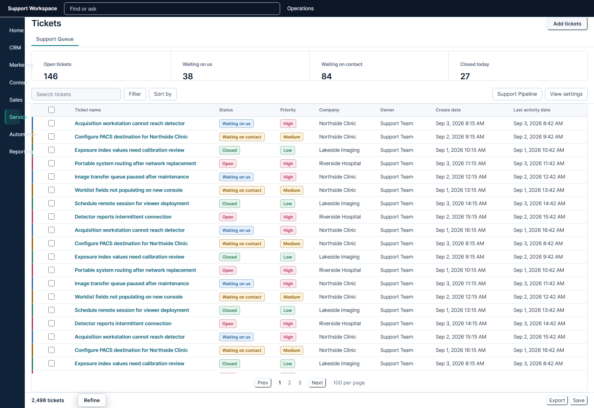
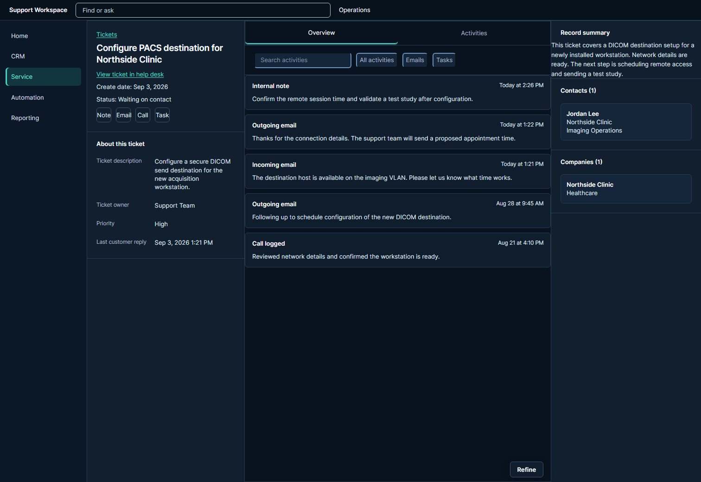
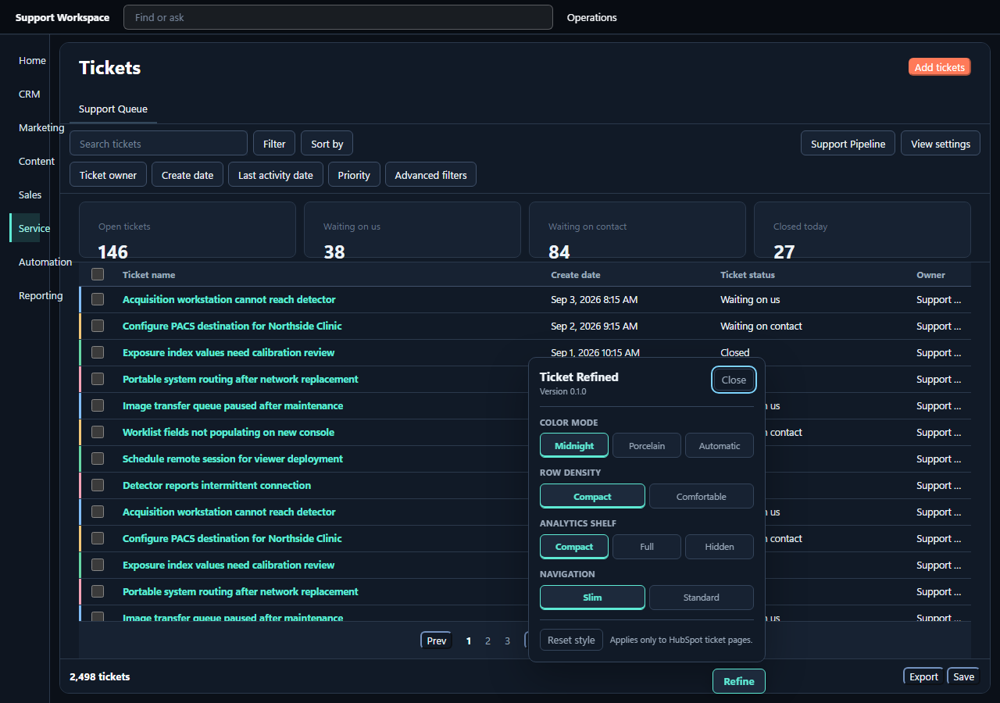

# HubSpot Ticket Refined


HubSpot Ticket Refined turns HubSpot's ticket list and ticket record pages into a calmer, denser workspace. It keeps the existing controls and data intact while sharpening hierarchy, reducing wasted space, and making long support sessions easier on the eyes.





## What changes

- Keeps 18 to 22 ticket rows visible on a typical desktop with compact density.
- Turns queue metrics into one restrained overview band so the table stays dominant.
- Refines ticket records into a focused details rail, activity timeline, and context rail.
- Includes Midnight, Porcelain, and automatic color modes.
- Keeps the analytics shelf available in compact, full, or hidden form.
- Uses stable HubSpot test hooks instead of generated class names where possible.
- Adds clear hover, focus, selected, loading, disabled, and semantic status treatments.

The script runs only on HubSpot ticket list and ticket record URLs. It checks visible status and priority labels to style rows, but it doesn't transmit or persist ticket content. Your preferences stay in the userscript manager's local storage.

## Install

1. Install Tampermonkey or Violentmonkey in your browser.
2. Open [the installable userscript](https://raw.githubusercontent.com/SysAdminDoc/HubSpot-Ticket-Refined/main/src/HubSpot-Ticket-Refined.user.js), then choose the userscript manager's install action.
3. Reload a HubSpot ticket page.

Use the **Refine** button near the lower-right corner to change theme, density, analytics shelf, or navigation width. The same settings are also available from the userscript manager menu.



Packaged files and checksums are available on the [Releases page](https://github.com/SysAdminDoc/HubSpot-Ticket-Refined/releases).

## Development

Requirements: Node.js 22 or newer and Google Chrome for visual capture.

```text
npm install
npm run check
```

`npm run check` lints the source, exercises the settings and route behavior against sanitized fixtures, and builds the installable userscript plus ZIP and checksums.

## Compatibility

The selectors are based on HubSpot's updated ticket index and record layouts from September 2026. HubSpot can change its internal markup without notice. If the theme stops applying to part of a page, open an issue with the page type and a screenshot that contains no customer data.
